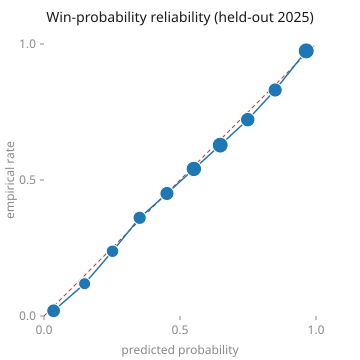
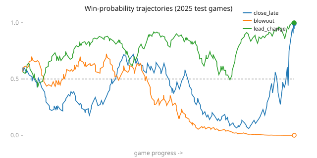

# CourtIQ

Bayesian player-impact and win-probability modeling on NBA play-by-play, built
for statistical rigor: regularized adjusted plus-minus (RAPM) with honest
uncertainty, and a calibrated in-game win-probability model validated against
held-out seasons and betting-market lines.

## Status

**Sprint 3 complete — win probability, RAPM ablation, nonlinear challenger, and
market comparison.** The validated RAPM feeds a leakage-safe possession-boundary
mart (1,273,794 states / 6,430 games) with forward-chaining
train/validation/test seasons, and an intercept-free L2 logistic win-probability
model fits on 2022–24 and is scored on the untouched 2025 test season. A nested
A→E ablation showed prior-season *team* strength adds held-out signal (Brier
−0.005) while the *specific on-court five* adds nothing beyond it. A hand-rolled
gradient-boosted challenger, given free rein over interactions on the *identical*
features, does **not** beat the additive logistic out of sample (Brier 0.15713 vs
0.15619, CI straddles zero) — the signal is confirmed ~linear. Against the market,
the model's pre-game probabilities are well-calibrated and correlate 0.73 with MGM
closing lines, but the market is sharper, as expected. Every published number
traces to one pinned corpus/feature/quality/split/model tuple and reproduces from
the on-disk artifacts.

## Results

Ratings are Offense/Defense RAPM at the possession grain, one offensive and
defensive coefficient per **player-season** (200-possession floor; fringe players
pooled to replacement). The ridge point estimate is the MAP of a conjugate
Gaussian model, so the Bayesian model is the *same* fit with a full posterior —
the point estimates are identical and the posterior adds honest uncertainty.
All numbers below are held-out (test games never seen in training or λ-selection)
and reproducible from corpus `f3494b21`.

**Out-of-sample retrodiction** — predict held-out game margins, 1,283 games
(RMSE, lower is better):

| Method | Margin RMSE |
|---|---|
| **Ridge / Bayesian RAPM** | **13.63** |
| Team net-rating | 15.06 |
| Predict the mean (floor; margin σ = 15.43) | 15.44 |
| Raw plus-minus (unadjusted) | 30.33 |

RAPM is the only method that meaningfully beats the constant-mean floor (−11.7%),
and it beats team-strength too. Single-game margins are variance-dominated, so
this is a strong retrodiction; raw plus-minus is *worse* than the floor because
it mis-attributes teammates' and opponents' quality — exactly what the adjustment
fixes.

**Calibration** — the posterior's uncertainty is honest, not decorative.
Predictive 90% intervals for held-out margins, and simulation-based calibration
(SBC) recovering known planted effects:

| Nominal | 50% | 80% | 90% | 95% |
|---|---|---|---|---|
| Empirical coverage | 0.51 | 0.79 | 0.88 | 0.93 |

SBC parameter coverage at 90% is **0.90** over 40 synthetic datasets, confirming
the covariance/interval math. The mild shortfall at 90–95% is the expected,
reported consequence of modeling discrete possession points as Gaussian
(intra-game correlation the iid term can't capture) — not tuned away.

**Uncertainty tracks data volume.** Mean 90% credible-interval width (net rating,
per 100) by possession tercile:

| Tercile | mean possessions | mean 90% CI width |
|---|---|---|
| Low | 1,151 | 10.96 |
| Mid | 4,436 | 9.40 |
| High | 9,077 | 8.67 |

This is the payoff of the Bayesian layer: low-possession players shrink toward
zero with wide intervals that cross it, so the confident-looking extreme ratings
a ridge point estimate assigns to fringe players are correctly flagged as
uncertain.

**Leaderboard** (top net rating per 100, with 90% credible interval):

| Net | 90% CI | Player (season) | Poss |
|---:|---|---|---:|
| +9.11 | [+4.8, +13.5] | V. Wembanyama (2025-26) | 10,300 |
| +7.41 | [+3.2, +11.6] | S. Gilgeous-Alexander (2024-25) | 14,198 |
| +7.15 | [+2.8, +11.5] | C. Holmgren (2025-26) | 9,745 |
| +6.90 | [+2.8, +11.0] | S. Curry (2021-22) | 12,255 |
| +6.63 | [+2.4, +10.9] | G. Antetokounmpo (2024-25) | 9,837 |
| +6.43 | [+2.1, +10.7] | J. Tatum (2021-22) | 13,456 |
| +5.97 | [+1.5, +10.5] | J. Embiid (2021-22) | 10,348 |
| +5.72 | [+1.2, +10.2] | N. Jokić (2024-25) | 12,493 |

Every interval clears zero. Two 3-and-D role players (Finney-Smith, Caldwell-Pope)
also rank high — the signature of the collinearity between stars and the
teammates who share their minutes; the credible intervals are how much to trust
each estimate.

**Honest caveats.** (1) A within-season recency-weighted variant (60-day
half-life) reshuffles 6 of the top 10 — recency weighting materially moves
ratings, so the headline table is the unweighted fit. (2) Season-to-season net
ratings correlate r = 0.32 (n = 1,663 player pairs): real predictive signal, far
from deterministic (aging, role and roster change). (3) 2.2% of games are
quarantined (OT lineups the play-by-play can't reconstruct), dropped whole and
roughly evenly across teams — a small, near-unbiased gap.

_Regenerate: `python -m rapm.design && python -m rapm.ridge && python -m rapm.bayes && python -m rapm.results`._

### Win-probability feature dataset

`fct_game_states` contains the score, clock, possession, home/away fives, and
prior-season RAPM lineup strength immediately before each possession. Season
2021 is retained as `audit_only` cold start; 2022–23 are train, 2024 validation,
and 2025 the untouched test partition. Missing prior-season player ratings use
the zero-centered replacement prior and carry an explicit coverage status.

The model score is the monotone cumulative total from completed possessions,
which excludes the current possession and reconciles exactly to the official
box score. Raw feed scores are retained only as diagnostics: 5,434 states
(0.43%) disagree because of technical-point timing or feed anomalies, including
25 downward scoreboard corrections.

Build, gate, export, and audit:

```bash
./game_states.sh
```

Generated artifacts are under `data/winprob/`: `fct_game_states.parquet`,
`manifest.json`, and `audit.json`.

### Win-probability model (Phase 2)

An intercept-free L2 logistic model fit on 2022–24 (768,094 possession states)
and scored on the **untouched 2025 test season** (251,140 states / 1,258 games;
home-win base rate 55.4%). Every number below is out-of-sample — the test season
never enters training or λ-selection — and reproducible with `./winprob.sh`.

**Held-out 2025 headline.** Brier **0.16372**, log loss **0.48426**. Calibration,
from regressing the realized outcome on the model's logit, is intercept **−0.073**
and slope **1.031** (a perfectly calibrated model is 0 / 1): the probabilities are
honest, not merely discriminating.

**Versus leakage-safe baselines** (same test split; lower is better):

| Forecast | Brier | Log loss |
|---|---:|---:|
| Base rate (constant home-win probability) | 0.24706 | 0.68725 |
| Score + time | 0.16388 | 0.48459 |
| Score + time + possession | 0.16367 | 0.48403 |
| **Logistic model** | **0.16372** | **0.48426** |

**Honest caveats.** (1) The model passes the Phase-2 gate — it beats the
score-and-time baseline on both Brier and log loss — but the edge is tiny (≈0.1%
of Brier), and a baseline that merely adds *who has the ball* (score + time +
possession) actually matches or slightly beats the full model on both metrics. At
the possession grain almost all of the signal is score, time, and possession; the
remaining features earn their keep only at the margin, so this is an honest
baseline, not a headline win. (2) Calibration holds in aggregate and within every
period, time-remaining, and margin bucket (no bucket of ≥250 states is
miscalibrated by more than 0.10), but the model is a linear-logit baseline with no
interactions or non-linearity beyond the fixed time knots. (3) 2021 is held out as
an `audit_only` cold-start season and is never scored.

_Regenerate: `./winprob.sh` (fits `winprob.model`, then scores and gates via `winprob.evaluate`)._

### RAPM lineup ablation (Phase 3)

Does knowing *which players are on the floor* — via prior-season RAPM — improve
held-out win probability once you already know the score, clock, and possession?
A nested ladder answers it on the **untouched 2025 test season** (251,140 states /
1,258 games), each tier adding one block of features and fit leakage-safe with its
own λ-selection. Uncertainty is a paired **game-clustered** bootstrap (resample
games, never rows), so each difference below is the honest test of a tier over the
one beneath it. Reproduce with `./ablation.sh`.

| Tier | Features | Brier | Log loss | vs. tier below (95% CI) |
|---|---|---:|---:|---|
| A | score + time | 0.16388 | 0.48459 | — |
| B | + possession | 0.16367 | 0.48403 | −0.00020 [−0.00023, −0.00017] |
| **C** | **+ pregame team strength** | **0.15865** | **0.47167** | **−0.00500 [−0.00972, −0.00013]** |
| D | + current-lineup net RAPM | 0.15861 | 0.47183 | −0.00004 [−0.00064, +0.00055] |
| E | + RAPM coverage counts | 0.15619 | 0.46574 | −0.00242 [−0.00360, −0.00124] |

**The finding.** Prior-season **team strength adds real out-of-sample signal** —
Brier −0.00500 with a confidence interval that clears zero, roughly 25× the
≈0.0002 a possession term buys. But **current-lineup RAPM adds essentially nothing
beyond it**: the D−C interval straddles zero. Team strength is the confound, and
once it is controlled the specific five on the floor carries no additional
held-out win-probability signal — lineup-level RAPM's apparent value is team
quality in disguise. This is a null, and it *is* the result: the gate that asks
RAPM to beat team strength fails, correctly, and the run still exits clean because
every *structural* gate (predictions in (0, 1), late-game calibration not
degraded, every rating strictly prior to its game) holds.

**Honest caveats.** (1) The coverage-count tier (E) does lower Brier with a CI
clearing zero, but rated-player counts are a roster-experience proxy — established
players are the ones with prior-season ratings — not lineup skill, so it is
reported, not gated, and should not be read as lineup RAPM helping. (2) The
rolling-fold reproduction check passes on the *sign* of D−C in both a 2024-test and
a 2025-test fold, but both point estimates are within bootstrap noise, so it
corroborates the null rather than any improvement. (3) Team strength is a
per-(team, season) pooled mean of on-court net RAPM; because season is part of the
key, a test-season team's strength is a function of test rows only and never leaks
into the fitted train/validation coefficients.

_Regenerate: `./ablation.sh` (fits A→E, then scores and gates via `winprob.ablation`)._

### Gradient-boosted challenger (Phase 4)

The logistic is **additive** in its features — it hand-builds a little
nonlinearity (`margin/√time`, time knots) but structurally cannot represent an
interaction like `margin × team_strength` (a *strong* team down six behaves unlike
a *weak* one in the same state). Phase 4 asks whether a model that *can* learn
those interactions beats it out of sample. The challenger is a hand-rolled
histogram **Newton gradient-boosted** tree ensemble (`winprob.gbm`, pure numpy, no
third-party ML dependency) trained on the **identical tier-E features** minus the
constant intercept — so the *only* difference from its opponent is
nonlinearity/interactions, not the feature set. Both are fit leakage-safe
(hyperparameters selected on 2024, refit on 2022–24) and scored on the **untouched
2025 test season**. Reproduce with `./challenger.sh`.

**Held-out 2025 (lower is better):**

| Model | Brier | Log loss | Calibration (intercept / slope) |
|---|---:|---:|---|
| **Tier-E logistic** | **0.15619** | **0.46574** | +0.060 / 0.986 |
| Gradient-boosted challenger | 0.15713 | 0.46743 | +0.079 / 1.094 |
| GBM − logistic (paired, game-clustered 95% CI) | +0.00096 [−0.00046, +0.00244] | +0.00169 [−0.00257, +0.00588] | — |

**The finding.** The nonlinear challenger does **not** beat the additive logistic
— it is marginally *worse* on both Brier and log loss, and the paired difference
interval straddles zero on both. With no real interaction signal to exploit, the
tree ensemble's flexibility buys only variance, not accuracy. The verdict is
**retain the logistic**; all structural gates (predictions in (0, 1), holdout
untouched, every rating strictly prior) pass, so the run exits clean on an honest
null. This is the intended, publishable Phase-4 result: it converts Phase 3's
"the signal looks ~linear" from an assumption into an out-of-sample measurement.

**The model chose against interactions.** Hyperparameter selection (validation
game-clustered log-loss) is itself corroborating evidence — every deeper (more
interaction-capable) configuration scored *worse* on validation than its shallow
twin, so the search settled on the shallowest, most additive model on offer:

| learning rate | max depth | trees | validation log loss |
|---:|---:|---:|---:|
| **0.05** | **2** | **152** | **0.473196** |
| 0.05 | 3 | 85 | 0.476597 |
| 0.10 | 2 | 77 | 0.473705 |
| 0.10 | 3 | 38 | 0.477924 |

**Honest caveats.** (1) The GBM is well-calibrated (slope 1.094 is mildly
over-confident but inside tolerance, and no ≥250-state phase bucket is
miscalibrated by more than 0.10), so it loses on *sharpness*, not calibration —
there is simply no additional held-out signal for it to sharpen on. (2) The
challenger receives the same engineered `margin/√time` and time-knot columns the
logistic needs, so any gain would have had to come from interactions *beyond* what
those hand-built terms already capture; none materialized. (3) The comparison is a
single held-out season (2025); the game-clustered bootstrap is the game-level
uncertainty test, and a season-level rolling check would require refitting the GBM
on a different split (out of Phase-4 scope — Phase 3 established that machinery for
the RAPM question).

_Regenerate: `./challenger.sh` (selects + fits `winprob.gbm`, then races the
tier-E logistic and gates via `winprob.challenger`)._

### Calibration and trajectories (Phase 5)

Calibration on the held-out 2025 season is tight: every reliability bin sits within
0.031 of its empirical rate, hugging the perfect-calibration diagonal. The
probability trajectories show the model tracking three representative games — a
close final that dipped to 0.06 before the home team held on, an away blowout to
0.00, and a lead-change swinging 0.43↔1.00.





Held-out coverage is one untouched season by the forward-chaining design (2025);
the Phase-3 rolling folds add a second held-out fold (2024) for the RAPM question.
Figures are hand-rolled SVG (no plotting dependency) and regenerate with
`./report.sh`.

### Model vs. market (Phase 5)

Does the model's *pre-game* win probability hold up against the betting market? The
only honest alignment for a pre-tip closing line is the model's **opening-state**
probability, and only the rating-aware tier-E model varies by matchup before tip
(the sparse score+time model predicts the base rate for every game). The benchmark
is **MGM vig-free closing moneylines** from a public dataset, covering **769 of the
1,258 test games** — the 2025-26 regular season through the All-Star break (no
playoffs). Comparison on those games (lower Brier is better):

| Pre-game forecast | Brier | Log loss | Calibration (intercept / slope) |
|---|---:|---:|---|
| Tier-E model | 0.22990 | 0.65136 | −0.004 / 0.864 |
| **Market (MGM, vig-free)** | **0.21466** | **0.61787** | −0.016 / 0.889 |
| Market − model (paired, game-clustered 95% CI) | **−0.01518 [−0.02419, −0.00626]** | −0.03334 [−0.05326, −0.01344] | — |

**The finding.** The **market is sharper** — the paired difference clears zero on
both Brier and log loss — which is exactly what should happen: the market prices
injuries, rest, travel, and matchup edges that a season-pooled RAPM cannot see. But
the model is **honest about what it knows**: its pre-game probabilities are
well-calibrated (intercept −0.004) and **correlate 0.73** with the closing line,
and both beat the base-rate Brier (0.2481) — the model captures real pre-game
signal, the market simply captures more. The gate here is the model's own pre-game
calibration (it passes); beating the market is not the bar, and a sharper market is
reported, not treated as a failure.

**Honest caveats.** (1) Coverage stops at the All-Star break (the only free,
ungated 2025-26 moneyline source), so this is a regular-season, no-playoff slice.
(2) The lines are single-book (MGM) closing moneylines, attributed to their source
and pinned by sha256 in the audit; they are not a multi-book consensus. (3)
Pre-game Brier (~0.21–0.23) is far higher than in-game Brier (0.156) because at
tip-off there is no score to condition on — the two are not comparable.

_Regenerate: `./market.sh` (fits tier E, joins the odds, and gates via
`winprob.market`; see the script header for the one-line odds download)._

### Reproducibility

Every published result traces to one immutable provenance tuple, and the final gate
re-hashes the on-disk mart and model to prove the artifacts each number was computed
against are the ones still present:

```
corpus f3494b21 · split eb69be5d · feature-schema 80d9e8f0 · model 30a4972b · parquet 685233a9
```

`./report.sh` walks the mart→model→ablation→challenger chain, asserts one consistent
tuple, and emits `results.json` with an `all_results_reproduce` boolean (all ten
checks pass). Tampering any single link — a downstream hash, a quality gate, an
on-disk file — flips the gate and pinpoints the break.

## Pipeline

| Stage | What it does |
|---|---|
| **Ingest** (`ingest/`) | Resumable, rate-limited pull of 5 seasons of play-by-play + box scores to raw JSON. |
| Reconstruction (dbt) | Possessions and on-floor lineups from the event log; validated against official box scores. |
| RAPM | Hierarchical Bayesian adjusted plus-minus vs. a ridge baseline, out-of-sample tested. |
| Win probability | Calibrated P(home win) from game state + lineup strength; leakage-controlled. |

Seasons: 2021-22 through 2025-26. The 2019-20 and 2020-21 seasons are excluded
deliberately — the bubble and 72-game COVID seasons have anomalous pace, rest,
and home-court structure.

## Setup

```bash
python3 -m venv .venv && source .venv/bin/activate
pip install -r requirements.txt
python -m ingest.pull            # full pull (~5h, resumable)
python -m ingest.pull --limit 3  # smoke test
```
